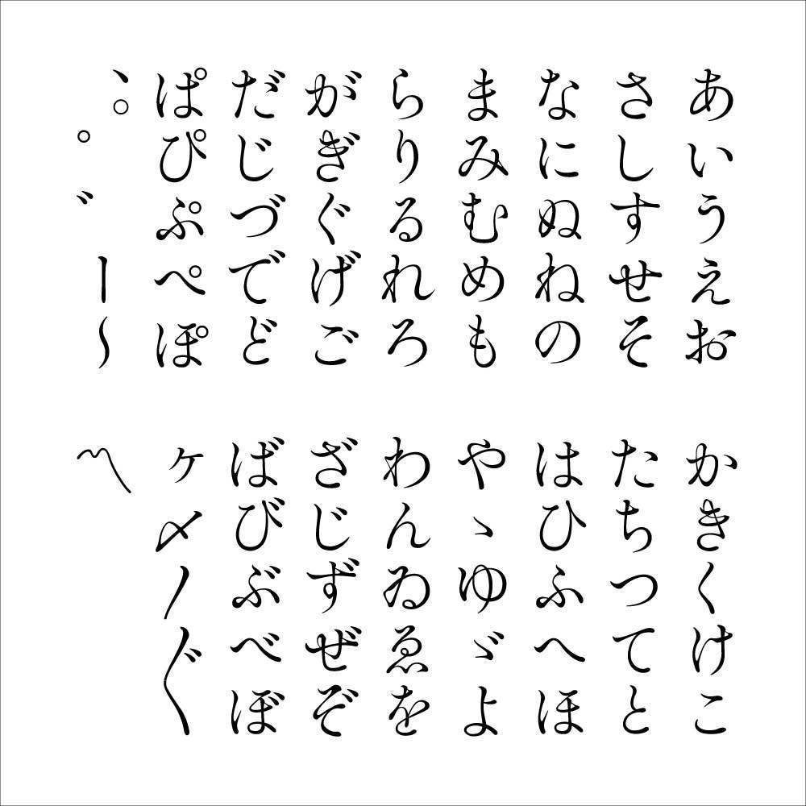
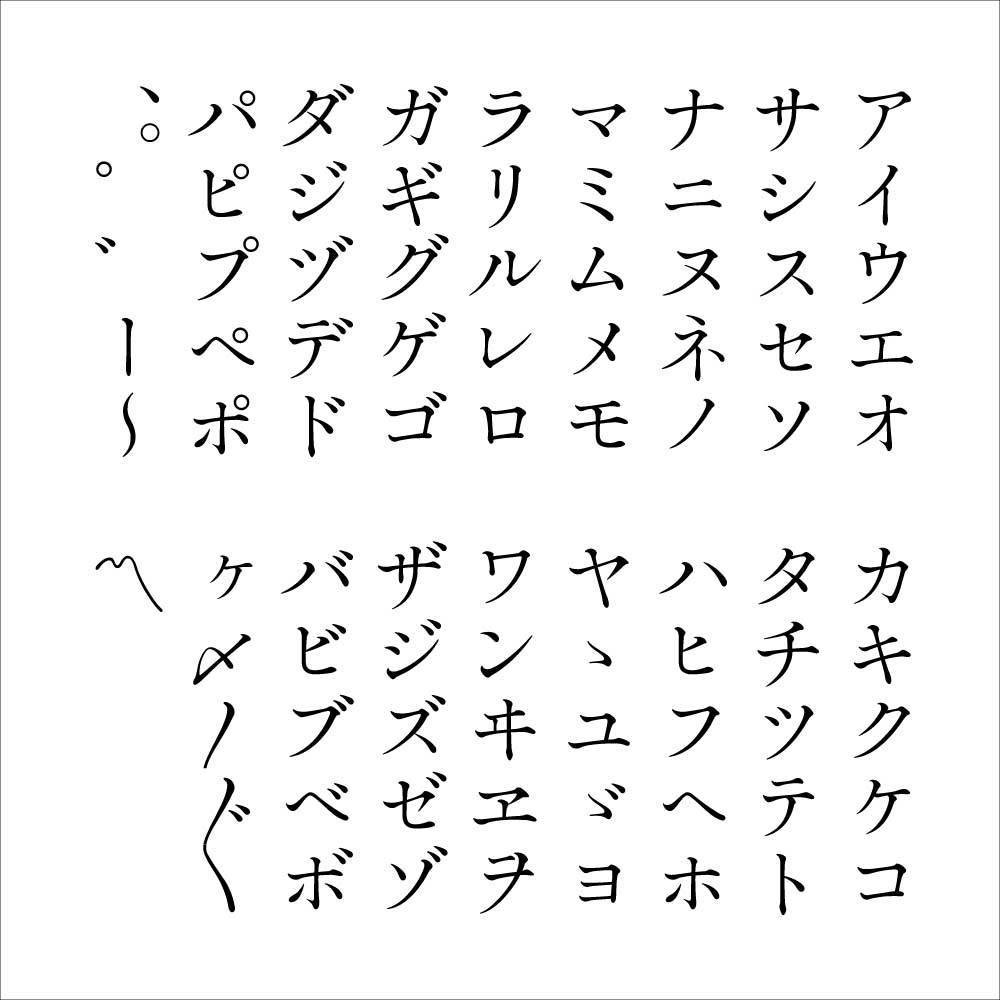
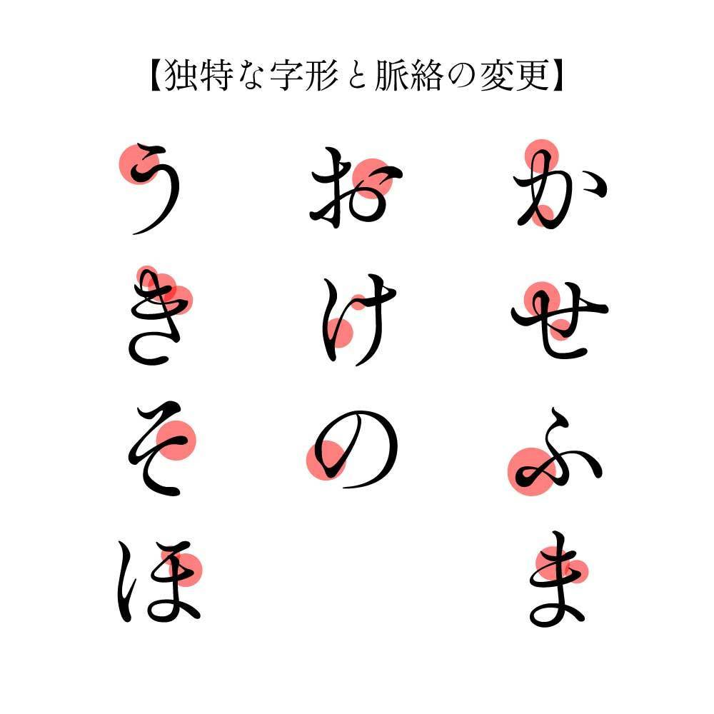

# 築豊明朝

## 書体概要

築豊明朝（つくほうみんちょう）は築地五号系の伝統的な本文向け明朝体を意識して作られたかな書体です。
伝統な部分を残しつつ、一部のかなの脈絡を変更することで筆の動きや柔らかさをより強調させました。独特な字形もあり、本文だけではなく、見出しやタイトルでも使っても目を惹きつけられるかもしれません。
漢字や欧文は「ZENオールド明朝 Regular」からお借りしています。

## SIL Open Font License

SIL Open Font License Version 1.1をご参照ください。
